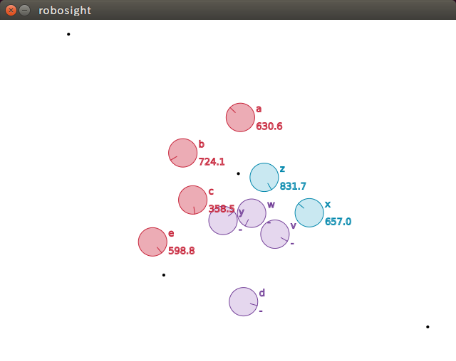

# robosight

robosightは、ロボット戦車の思考ルーチンを作成して相互に対戦することで、楽しくプログラミング能力を競うソフトウェアです。

## Rules

ごめんなさい、作成中です。。。

## How to Play

ごめんなさい、作成中です。。。

## How to Build

### ソース・コードを取得する

```bash
$ git clone git://github.com/tail-island/robosight.git
$ cd robosight
$ git submodule init
$ git submodule update
```

ネットワーク環境の制約でgitプロトコルが使用できない場合は、以下の手順を試してみてください。

```bash
$ git clone https://github.com/tail-island/robosight.git
$ gedit .gitmodules （して、'git'を'https'に変更）
$ git submodule init
$ git submodule update
```

### Dockerコンテナを起動する

※Linux以外の環境の場合は、本項は無視して「Leiningenをセットアップする」に進んでください。

[Docker](https://www.docker.com)と[Docker Compose](https://docs.docker.com/compose)をインストールしてください。

NvidiaのGPUを使用している場合は`docker-compose-nvidia.yml`を、IntelのGPUを使用している場合は`docker-compose-intel.yml`を`docker-compose.yml`にシンボリック・リンクし（ごめんなさい、ATIは環境を持っていないので作っていません）、`docker-compose build`して`docker-compose run app bash`してください。

```bash
$ ln -s docker-compose-xxx.yml docker-compose.yml
$ docker-compose build
$ docker-compose run app bash
```

※2回目以降は、`docker-compose run app bash`の実行だけで大丈夫です。

なお、プロキシを使用する場合は、`docker-compose.yml`を以下に変更して`docker-compose bulid`や`docker-compose run`してください。

```
#（略）

services:
  app:
    build:
      context: .
      args:
        - http_proxy=http://<プロキシのIPアドレス>:<プロキシのポート>
        - https_proxy=http://<プロキシのIPアドレス>:<プロキシのポート>
    #（略）
    environment:
      - http_proxy=http://<プロキシのIPアドレス>:<プロキシのポート>
      - https_proxy=http://<プロキシのIPアドレス>:<プロキシのポート>
      - DISPLAY=${DISPLAY}
```

### もしくは、Leiningeをセットアップする

※前項の「Dockerコンテナを起動する」を実施した場合は、本項は無視して「Checkout Dependenciesを設定する」に進んでください。

[Leiningen](https://leiningen.org)の「Install」の記述に従ってLeiningenをセットアップしてください（シェル・スクリプト（Windowsの場合はバッチ・ファイル）をダウンロードして、パスを通すだけです）。

### Checkout Dependenciesを設定する

robosightは複数のプロジェクトに分かれていて依存関係がありますので、[Checkout Dependencies](https://github.com/technomancy/leiningen/blob/master/doc/TUTORIAL.md)を設定してください。

```bash
$ cd robosight-battlefield
$ mkdir checkouts
$ cd checkouts
$ ln -s ../../robosight-core .
```

```bash
$ cd robosight-visualizer
$ mkdir checkouts
$ cd checkouts
$ ln -s ../../robosight-core .
```

※Windowsの場合は、`ln`の代わりに、管理者権限でCommand Promptを起動して`mklink /D robosight-core ..\..\robosight-core`してください。

上記の作業を実施した場合でも、一度は`robosight-core`で`lein install`しておいてください。

```bash
$ cd robosight-core
$ lein install
```

### robosightを試してみる

※Windowsをご使用の場合は、本項は無視して「Leiningenでビルドする」に進んでください。

テスト用の`robosight-sample`をコンパイルします。

```bash
$ cd robosight-sample
$ lein compile
```

テスト用のスクリプトを実行してください。

```bash
$ ./t
```

サンプル・プログラムを使用した対戦がはじまりすので、ご鑑賞ください。



### Leiningenでビルドする

```bash
$ cd robosight-battlefield
$ lein checkouts uberjar
$ cp ./target/robosight-battlefield-0.1.0-standalone.jar <コピー先>
```

```bash
$ cd robosight-visualizer
$ lein checkouts uberjar
$ cp ./target/robosight-visualizer-0.1.0-standalone.jar <コピー先>
```

## License

Copyright © 2017 OJIMA Ryoji

Distributed under the Eclipse Public License either version 1.0 or any later version.
